  

 

<!-- ===================== ABOUT ME ===================== -->
<!-- 소개를 여기에 작성해 주세요 -->

 

---

## 🛠 Stack

  
  
  
  
  
  
  
  
  
  
  
  
  
  
  
  
  
  

&nbsp;

---

## 🚀 Projects

<!-- 프로젝트를 아래 형식으로 추가해 주세요 -->
* **[프로젝트 이름](https://링크)** - 프로젝트 설명
* **[프로젝트 이름](https://링크)** - 프로젝트 설명
* **[프로젝트 이름](https://링크)** - 프로젝트 설명

&nbsp;

---

## 📊 GitHub Stats

&nbsp;

  

&nbsp;

  

